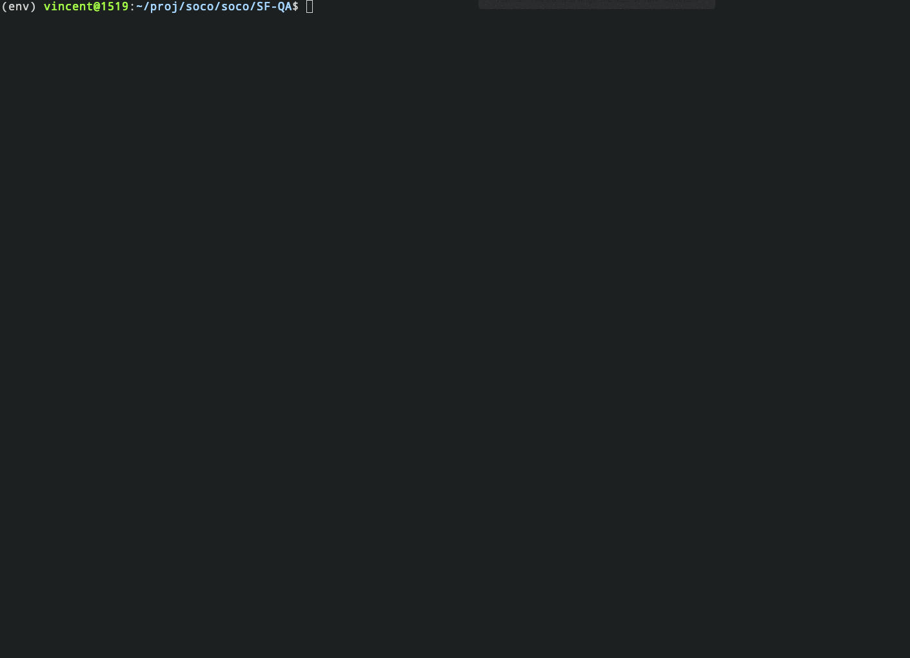

<p align="center">
    <br>
    
    <br>
<p>
<p align="center">
    <a href="https://github.com/soco-ai/SF-QA/LICENSE.txt">
        
    </a>
    <a href="https://github.com/soco-ai/SF-QA/releases">
        
    </a>
    <a href="https://twitter.com/soco_ai">
        
    </a>
</p>

<h3 align="center">
<p>A Simple and Fair Evaluation Library for Open-domain Question Answering
</h3>

# Introduction
Open-domain QA Evaluation usually means days of tedious work on indexing large scale of data and building the pipeline. That's why we create SF-QA [[EACL 2021 Demo paper]](https://www.aclweb.org/anthology/2021.eacl-demos.2/).

We make the evaluation process simple and fast by establishing a standard evalution system with the same source so researchers can focus on their proposed method instead of spending significant time to
reproduce the existing approaches in research

 SF-QA helps you to evaluate your open-domain QA without building the entire open-domain QA pipeline. It supports:
 - Efficient Reader Comparison
 - Reproducible Research 
 - Knowledge Source for Applications

# Features
✨ **Easy evaluation framework:** Build especially for open-domain QA  
✨ **Pre-trained Wiki dataset:** No need to train it yourself   
✨ **Scaleable:** set your own configurations and evaluate on the open domain scale.  
✨ **Open source:** Everyone can contribute


# Installation 
SF-QA requires Python 3, Pytorch 1.6.0. Transformer 2.11.0, elasticsearch 7.5.0

```
pip install -r requirements.txt
```

# How to use SFQA


## Usage 1: Ask questions and interact with open-QA demo

### 1. In `demo.py`, set reader model and ranker index you want to try from the following list:

* reader model available: 
    * English:
        - squad-ds-context-global-norm-2016sparta-from-pt
        - squad-chunk-global-norm-2016bm25-bert-base-uncased
    * Chinese:
        - cmrc2018-ds-context-global-norm-2018sparta-from-pt-v1
        - drcd-ds-context-global-norm-2017sparta-from-pt-v1

* ranker index available:
    * English:
        - sparta-en-wiki-2016
        - bm25-en-wiki-2016
    * Chinese:
        - sparta-zh-wiki-2020

### 2. Run demo file

```
python demo.py
```



## Usage 2: Reproduce previous research result 
Run the script to evaluate open QA with config.yaml file under `./config` folder.
```
python example.py --config ./config/sparta/squad-sparta-spanbert.yaml
```

```yaml
data:
    lang: en
    name: squad
    split: dev-v1.1.json
ranker:
    use_cached: True
    cached_ranker_file: squad_dev_wiki_sparta_2016sparta.json
reader:
    model_id: squad-ds-context-global-norm-2016sparta-from-pt
param:
    n_gpu: 1
    score_weight: 0.8
    top_k: 50

```


---

## SF-QA APIs
- POST
	- https://api.soco.ai/v1/sfqa/query
- Header
	- Authorization: soco_research
	- Content-Type: application/json

- Body
```
{   
    "lang": "en",
    "index": "wiki-frame-2016",
    "model_id": "spanbert-large-squad2",
    "query": "What Swiss city was the center of the Calvinist movement?",
    "params": {
        "top_k": 10,
        "n_best": 2,
        "ranker_only":true
    }
}
```

- Response
```
{
    "result": [
        {
            "value": "Geneva",
            "score": 8.959972752954101,
            "prob": 0.981730729341507,
            "source": {
                "context": "Huguenot. The nickname may have been a combined reference to the Swiss politician Besançon Hugues (died 1532) and the religiously conflicted nature of Swiss republicanism in his time, using a clever derogatory pun on the name \"Hugues\" by way of the Dutch word \"Huisgenoten\" (literally \"housemates\"), referring to the connotations of a somewhat related word in German \"Eidgenosse\" (\"Confederates\" as in \"a citizen of one of the states of the Swiss Confederacy\"). Geneva was John Calvin's adopted home and the centre of the Calvinist movement. In Geneva, Hugues, though Catholic, was a leader of the \"Confederate Party\", so called because it favoured independence from the Duke of Savoy through an alliance between the city-state of Geneva and the Swiss Confederation.",
                "url": null,
                "title": null
            }
        },
      ...
    ]
}
```
When ranker_only is true, it will just return the sentence level answer in the value with the context. 
```
{
    "result": [
        {
            "score": 17.94549,
            "answer": {
                "answer_start": 317,
                "context": "Canton of Geneva. As is the case in several other Swiss cantons (e.g. Ticino, Neuchâtel, and Jura), this canton is referred to as a republic within the Swiss Confederation. The canton of Geneva is located in the southwestern corner of Switzerland; and is considered one of the most cosmopolitan areas of the country. As a center of the Calvinist Reformation, the city of Geneva has had a great influence on the canton, which essentially consists of the city and its hinterlands. Geneva was a Prince-Bishopric of the Holy Roman Empire from 1154, but from 1290, secular authority over the citizens was divided from the bishop's authority, at first only lower jurisdiction, the office of vidame given to François de Candie in 1314, but from 1387 the bishops granted the citizens of Geneva full communal self-government.",
                "displayable": false,
                "value": "As a center of the Calvinist Reformation, the city of Geneva has had a great influence on the canton, which essentially consists of the city and its hinterlands.",
                "add_to_qa_index": true
            },
            "meta": {
                "2016": true,
                "doc_id": "Canton of Geneva",
                "chunk_id": "91a26e05-0c9c-470b-a9e1-9e8635af265c",
                "chunk_type": "content"
            }
        },
```

# Download Data

## Preprocessed wikipedia dump 
The processed Wikipedia can be downloaded in the following links:
- Paragraph Level: [wiki_2016](https://sfqa.s3.us-east-2.amazonaws.com/wikidump/2016/wiki_2016_paragraphs.jsonl.bz2)
- Sentence Level: [wiki_2016](https://sfqa.s3.us-east-2.amazonaws.com/wikidump/2016/wiki_2016_frames.jsonl.bz2)
- Phrase Level: You can use either paragraph level wiki or sentence level wiki to get n-best passages, then get the 1-best phrase using a machine reader. 

## Cached Retrieval Results 
- [Wiki_2016_BM25](https://sfqa.s3.us-east-2.amazonaws.com/data/wiki-frame-2016_sent_bm25_context.json)
- [Wiki_2016_SPARTA](https://sfqa.s3.us-east-2.amazonaws.com/data/wiki-frame-2016_sparta_context.json)

Please contact to contact@soco.ai to contribute your cached retrieval results. 


# How to Contribute
Contribution is welcomed to this project!
To contribute via pull request, follow these steps:

- Create an issue describing the feature you want to work on
- Write your code, tests and documentation, and format them with black
- Create a pull request describing your changes


# License
This project is licensed under the Apache License, Version 2.0.
